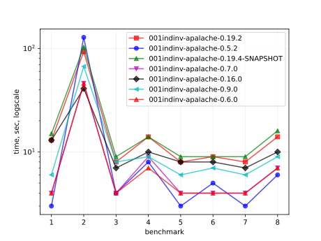
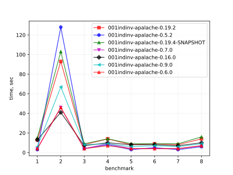
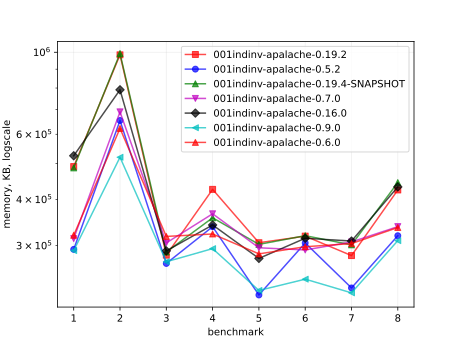
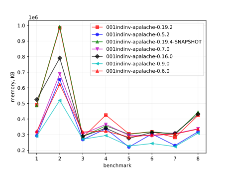
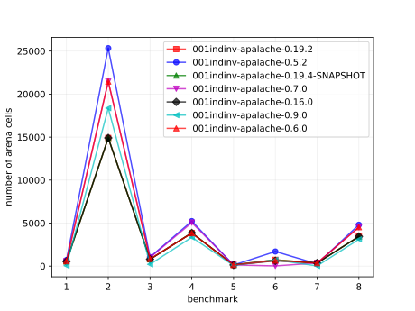
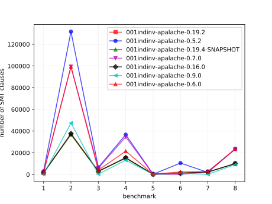

# Results of 001indinv-apalache

## 1. Awesome plots

### 1.1. Time (logarithmic scale)

### 1.2. Time (linear)

### 1.3. Memory (logarithmic scale)

### 1.4. Memory (linear)

### 1.5. Number of arena cells (linear)

### 1.6. Number of SMT clauses (linear)

## 2. Input parameters

no  |  filename                          |  tool      |  timeout  |  init                   |  inv                    |  next  |  args
----|------------------------------------|------------|-----------|-------------------------|-------------------------|--------|--------------------------------
1   |  Bakery-Boulangerie/APABakery.tla  |  apalache  |  1h       |  Init                   |  Inv                    |        |  --length=0
2   |  Bakery-Boulangerie/APABakery.tla  |  apalache  |  1h       |  Inv                    |  Inv                    |        |  --length=1
3   |  ewd840/APAEWD840.tla              |  apalache  |  3h       |                         |  InvAndTypeOK           |        |  --length=0 --cinit=ConstInit10
4   |  ewd840/APAEWD840.tla              |  apalache  |  3h       |  InvAndTypeOK           |  InvAndTypeOK           |        |  --length=1 --cinit=ConstInit10
5   |  bcastByz/APAbcastByz.tla          |  apalache  |  3h       |  InitNoBcast            |  IndInv_Unforg_NoBcast  |        |  --length=0 --cinit=ConstInit4
6   |  bcastByz/APAbcastByz.tla          |  apalache  |  3h       |  IndInv_Unforg_NoBcast  |  IndInv_Unforg_NoBcast  |        |  --length=1 --cinit=ConstInit4
7   |  two-phase/APATwoPhase.tla         |  apalache  |  23h      |                         |  Inv                    |        |  --length=0 --cinit=ConstInit7
8   |  two-phase/APATwoPhase.tla         |  apalache  |  23h      |  InitInv                |  Inv                    |        |  --length=1 --cinit=ConstInit7

## 3. Detailed results: 001indinv-apalache-0.7.0.csv

01:no  |  02:tool   |  03:status  |  04:time_sec  |  05:depth  |  05:mem_kb  |  10:ninit_trans  |  11:ninit_trans  |  12:ncells  |  13:nclauses  |  14:navg_clause_len
-------|------------|-------------|---------------|------------|-------------|------------------|------------------|-------------|---------------|--------------------
1      |  apalache  |  NoError    |  11s          |  0         |  63MB       |  0               |  0               |  585        |  1.0K         |  9.0
2      |  apalache  |  NoError    |  47s          |  1         |  61MB       |  0               |  0               |  21K        |  99K          |  13
3      |  apalache  |  NoError    |  5s           |  0         |  63MB       |  0               |  0               |  1.0K       |  5.0K         |  12
4      |  apalache  |  NoError    |  8s           |  1         |  61MB       |  0               |  0               |  5.0K       |  34K          |  12
5      |  apalache  |  NoError    |  4s           |  0         |  63MB       |  0               |  0               |  141        |  296          |  9.0
6      |  apalache  |  Error      |  4s           |  0         |  63MB       |  0               |  0               |  26         |  48           |  7.0
7      |  apalache  |  NoError    |  4s           |  0         |  63MB       |  0               |  0               |  364        |  2.0K         |  6.0
8      |  apalache  |  NoError    |  8s           |  1         |  63MB       |  0               |  0               |  4.0K       |  23K          |  13

## 4. Detailed results: 001indinv-apalache-0.6.1.csv

01:no  |  02:tool   |  03:status  |  04:time_sec  |  05:depth  |  05:mem_kb  |  10:ninit_trans  |  11:ninit_trans  |  12:ncells  |  13:nclauses  |  14:navg_clause_len
-------|------------|-------------|---------------|------------|-------------|------------------|------------------|-------------|---------------|--------------------
1      |  apalache  |  NoError    |  11s          |  0         |  63MB       |  0               |  0               |  585        |  1.0K         |  8.0
2      |  apalache  |  NoError    |  42s          |  1         |  61MB       |  0               |  0               |  21K        |  99K          |  13
3      |  apalache  |  NoError    |  4s           |  0         |  61MB       |  0               |  0               |  842        |  3.0K         |  10
4      |  apalache  |  NoError    |  6s           |  1         |  63MB       |  0               |  0               |  3.0K       |  21K          |  12
5      |  apalache  |  NoError    |  4s           |  0         |  63MB       |  0               |  0               |  141        |  296          |  8.0
6      |  apalache  |  NoError    |  4s           |  1         |  63MB       |  0               |  0               |  657        |  2.0K         |  13
7      |  apalache  |  NoError    |  4s           |  0         |  63MB       |  0               |  0               |  364        |  2.0K         |  6.0
8      |  apalache  |  NoError    |  7s           |  1         |  61MB       |  0               |  0               |  4.0K       |  23K          |  13
