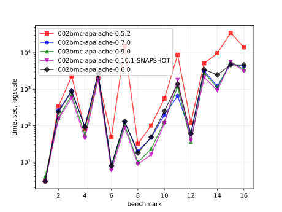
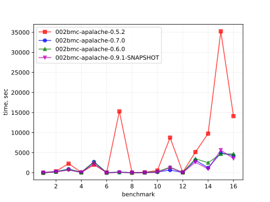
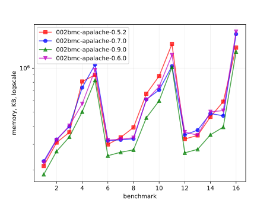
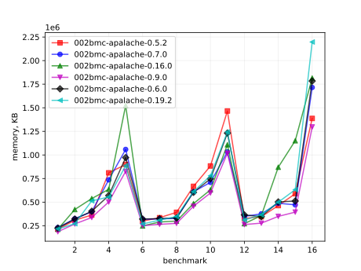
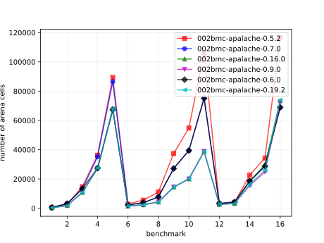
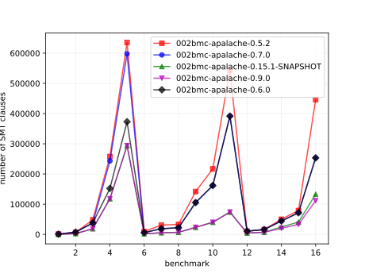

# Results of 002bmc-apalache

## 1. Awesome plots

### 1.1. Time (logarithmic scale)

### 1.2. Time (linear)

### 1.3. Memory (logarithmic scale)

### 1.4. Memory (linear)

### 1.5. Number of arena cells (linear)

### 1.6. Number of SMT clauses (linear)

## 2. Input parameters

no  |  filename                            |  tool      |  timeout  |  init  |  inv                |  next  |  args
----|--------------------------------------|------------|-----------|--------|---------------------|--------|---------------------------------
1   |  traffic/APAtraffic.tla              |  apalache  |  1h       |        |                     |        |  --length=4
2   |  Prisoners/APAPrisoners.tla          |  apalache  |  30m      |        |  SafetyInv          |        |  --length=15 --cinit=ConstInit
3   |  Bakery-Boulangerie/APABakery.tla    |  apalache  |  10h      |        |  MutualExclusion    |        |  --length=8
4   |  ewd840/APAEWD840.tla                |  apalache  |  1h       |        |  Inv                |        |  --length=12 --cinit=ConstInit4
5   |  ewd840/APAEWD840.tla                |  apalache  |  5h       |        |  Inv                |        |  --length=30 --cinit=ConstInit10
6   |  allocator/APASimpleAllocator.tla    |  apalache  |  10h      |        |  ResourceMutex      |        |  --length=7 --cinit=ConstInit22
7   |  allocator/APASimpleAllocator.tla    |  apalache  |  23h      |        |  ResourceMutex      |        |  --length=7 --cinit=ConstInit53
8   |  bcastFolklore/APAbcastFolklore.tla  |  apalache  |  30m      |  Init  |                     |        |  --length=10 --cinit=ConstInit4
9   |  bcastFolklore/APAbcastFolklore.tla  |  apalache  |  30m      |  Init  |                     |        |  --length=10 --cinit=ConstInit20
10  |  bcastByz/APAbcastByz.tla            |  apalache  |  30m      |  Init  |                     |        |  --length=10 --cinit=ConstInit4
11  |  bcastByz/APAbcastByz.tla            |  apalache  |  23h      |  Init  |                     |        |  --length=11 --cinit=ConstInit6
12  |  two-phase/APATwoPhase.tla           |  apalache  |  23h      |        |  TCConsistent       |        |  --length=11 --cinit=ConstInit3
13  |  two-phase/APATwoPhase.tla           |  apalache  |  23h      |        |  TCConsistent       |        |  --length=10 --cinit=ConstInit7
14  |  paxos/Apa3Paxos.tla                 |  apalache  |  23h      |        |  OneValuePerBallot  |        |  --length=13
15  |  paxos/Apa5Paxos.tla                 |  apalache  |  23h      |        |  OneValuePerBallot  |        |  --length=14
16  |  raft/APAraft.tla                    |  apalache  |  23h      |        |  OneLeader          |        |  --length=8

## 3. Detailed results: 002bmc-apalache-0.5.2.csv

01:no  |  02:tool   |  03:status  |  04:time_sec  |  05:depth  |  05:mem_kb  |  10:ninit_trans  |  11:ninit_trans  |  12:ncells  |  13:nclauses  |  14:navg_clause_len
-------|------------|-------------|---------------|------------|-------------|------------------|------------------|-------------|---------------|--------------------
1      |  apalache  |  NoError    |  3s           |  4         |  208MB      |  1               |  4               |  501        |  999          |  8.0
2      |  apalache  |  NoError    |  5m05s        |  15        |  301MB      |  1               |  4               |  2.0K       |  6.0K         |  11
3      |  apalache  |  NoError    |  37m          |  8         |  354MB      |  1               |  16              |  14K        |  48K          |  11
4      |  apalache  |  NoError    |  1m01s        |  12        |  791MB      |  1               |  4               |  36K        |  257K         |  12
5      |  apalache  |  NoError    |  33m          |  30        |  878MB      |  1               |  4               |  89K        |  635K         |  12
6      |  apalache  |  NoError    |  48s          |  7         |  292MB      |  1               |  3               |  2.0K       |  9.0K         |  13
7      |  apalache  |  NoError    |  4h04m        |  7         |  327MB      |  1               |  3               |  5.0K       |  30K          |  16
8      |  apalache  |  NoError    |  32s          |  10        |  382MB      |  1               |  4               |  11K        |  33K          |  13
9      |  apalache  |  NoError    |  1m01s        |  10        |  651MB      |  1               |  4               |  37K        |  141K         |  13
10     |  apalache  |  NoError    |  9m09s        |  10        |  862MB      |  1               |  5               |  54K        |  216K         |  14
11     |  apalache  |  NoError    |  2h02m        |  11        |  1.0GB      |  1               |  5               |  106K       |  543K         |  15
12     |  apalache  |  NoError    |  1m01s        |  11        |  318MB      |  1               |  7               |  3.0K       |  10K          |  10
13     |  apalache  |  NoError    |  1h01m        |  10        |  337MB      |  1               |  7               |  4.0K       |  15K          |  10
14     |  apalache  |  NoError    |  2h02m        |  13        |  452MB      |  1               |  4               |  22K        |  50K          |  10
15     |  apalache  |  NoError    |  9h09m        |  14        |  575MB      |  1               |  4               |  34K        |  79K          |  10
16     |  apalache  |  NoError    |  3h03m        |  8         |  1.0GB      |  1               |  23              |  116K       |  445K         |  19

## 4. Detailed results: 002bmc-apalache-0.15.5-SNAPSHOT.csv

01:no  |  02:tool   |  03:status  |  04:time_sec  |  05:depth  |  05:mem_kb  |  10:ninit_trans  |  11:ninit_trans  |  12:ncells  |  13:nclauses  |  14:navg_clause_len
-------|------------|-------------|---------------|------------|-------------|------------------|------------------|-------------|---------------|--------------------
1      |  apalache  |  NoError    |  4s           |  0         |  195MB      |  0               |  0               |  324        |  458          |  9.0
2      |  apalache  |  NoError    |  8m08s        |  0         |  428MB      |  0               |  0               |  1.0K       |  2.0K         |  13
3      |  apalache  |  NoError    |  14m          |  0         |  468MB      |  0               |  0               |  10K        |  18K          |  12
4      |  apalache  |  NoError    |  1m01s        |  0         |  567MB      |  0               |  0               |  27K        |  118K         |  17
5      |  apalache  |  NoError    |  47m          |  0         |  1.0GB      |  0               |  0               |  67K        |  293K         |  17
6      |  apalache  |  NoError    |  8s           |  0         |  278MB      |  0               |  0               |  1.0K       |  2.0K         |  13
7      |  apalache  |  NoError    |  1m01s        |  0         |  263MB      |  0               |  0               |  2.0K       |  5.0K         |  19
8      |  apalache  |  NoError    |  11s          |  0         |  306MB      |  0               |  0               |  4.0K       |  6.0K         |  15
9      |  apalache  |  NoError    |  19s          |  0         |  486MB      |  0               |  0               |  14K        |  23K          |  20
10     |  apalache  |  NoError    |  1m01s        |  0         |  624MB      |  0               |  0               |  20K        |  40K          |  20
11     |  apalache  |  NoError    |  24m          |  0         |  1.0GB      |  0               |  0               |  38K        |  74K          |  26
12     |  apalache  |  NoError    |  45s          |  0         |  257MB      |  0               |  0               |  2.0K       |  4.0K         |  12
13     |  apalache  |  NoError    |  42m          |  0         |  271MB      |  0               |  0               |  3.0K       |  7.0K         |  12
14     |  apalache  |  NoError    |  36m          |  0         |  635MB      |  0               |  0               |  17K        |  24K          |  11
15     |  apalache  |  NoError    |  2h02m        |  0         |  1.0GB      |  0               |  0               |  28K        |  40K          |  11
16     |  apalache  |  NoError    |  57m          |  0         |  1.0GB      |  0               |  0               |  63K        |  133K         |  18

## 5. Detailed results: 002bmc-apalache-0.7.0.csv

01:no  |  02:tool   |  03:status  |  04:time_sec  |  05:depth  |  05:mem_kb  |  10:ninit_trans  |  11:ninit_trans  |  12:ncells  |  13:nclauses  |  14:navg_clause_len
-------|------------|-------------|---------------|------------|-------------|------------------|------------------|-------------|---------------|--------------------
1      |  apalache  |  NoError    |  3s           |  4         |  224MB      |  0               |  0               |  514        |  1.0K         |  8.0
2      |  apalache  |  NoError    |  4m04s        |  15        |  316MB      |  0               |  0               |  3.0K       |  7.0K         |  10
3      |  apalache  |  NoError    |  15m          |  8         |  388MB      |  0               |  0               |  13K        |  37K          |  11
4      |  apalache  |  NoError    |  1m01s        |  12        |  718MB      |  0               |  0               |  35K        |  243K         |  12
5      |  apalache  |  NoError    |  44m          |  30        |  1.0GB      |  0               |  0               |  86K        |  597K         |  12
6      |  apalache  |  NoError    |  8s           |  7         |  310MB      |  0               |  0               |  2.0K       |  5.0K         |  11
7      |  apalache  |  NoError    |  2m02s        |  7         |  314MB      |  0               |  0               |  3.0K       |  18K          |  14
8      |  apalache  |  NoError    |  20s          |  10        |  320MB      |  0               |  0               |  7.0K       |  22K          |  12
9      |  apalache  |  NoError    |  47s          |  10        |  596MB      |  0               |  0               |  27K        |  105K         |  14
10     |  apalache  |  NoError    |  3m03s        |  10        |  692MB      |  0               |  0               |  39K        |  161K         |  14
11     |  apalache  |  NoError    |  10m          |  11        |  1008MB     |  0               |  0               |  75K        |  391K         |  15
12     |  apalache  |  NoError    |  1m01s        |  11        |  340MB      |  0               |  0               |  3.0K       |  10K          |  11
13     |  apalache  |  NoError    |  52m          |  10        |  366MB      |  0               |  0               |  4.0K       |  16K          |  11
14     |  apalache  |  NoError    |  20m          |  13        |  476MB      |  0               |  0               |  18K        |  44K          |  11
15     |  apalache  |  NoError    |  1h01m        |  14        |  460MB      |  0               |  0               |  28K        |  71K          |  11
16     |  apalache  |  NoError    |  1h01m        |  8         |  1.0GB      |  0               |  0               |  68K        |  253K         |  25

## 6. Detailed results: 002bmc-apalache-0.9.0.csv

01:no  |  02:tool   |  03:status  |  04:time_sec  |  05:depth  |  05:mem_kb  |  10:ninit_trans  |  11:ninit_trans  |  12:ncells  |  13:nclauses  |  14:navg_clause_len
-------|------------|-------------|---------------|------------|-------------|------------------|------------------|-------------|---------------|--------------------
1      |  apalache  |  NoError    |  4s           |  0         |  182MB      |  0               |  0               |  314        |  454          |  9.0
2      |  apalache  |  NoError    |  2m02s        |  0         |  262MB      |  0               |  0               |  1.0K       |  2.0K         |  13
3      |  apalache  |  NoError    |  11m          |  0         |  329MB      |  0               |  0               |  10K        |  18K          |  12
4      |  apalache  |  NoError    |  57s          |  0         |  489MB      |  0               |  0               |  27K        |  117K         |  17
5      |  apalache  |  NoError    |  33m          |  0         |  806MB      |  0               |  0               |  67K        |  293K         |  17
6      |  apalache  |  NoError    |  7s           |  0         |  244MB      |  0               |  0               |  1.0K       |  2.0K         |  13
7      |  apalache  |  NoError    |  1m01s        |  0         |  258MB      |  0               |  0               |  2.0K       |  5.0K         |  19
8      |  apalache  |  NoError    |  10s          |  0         |  268MB      |  0               |  0               |  4.0K       |  6.0K         |  15
9      |  apalache  |  NoError    |  23s          |  0         |  445MB      |  0               |  0               |  14K        |  23K          |  20
10     |  apalache  |  NoError    |  2m02s        |  0         |  583MB      |  0               |  0               |  20K        |  40K          |  20
11     |  apalache  |  NoError    |  19m          |  0         |  993MB      |  0               |  0               |  38K        |  73K          |  26
12     |  apalache  |  NoError    |  36s          |  0         |  256MB      |  0               |  0               |  2.0K       |  4.0K         |  12
13     |  apalache  |  NoError    |  46m          |  0         |  270MB      |  0               |  0               |  3.0K       |  7.0K         |  12
14     |  apalache  |  NoError    |  18m          |  0         |  340MB      |  0               |  0               |  15K        |  20K          |  13
15     |  apalache  |  NoError    |  1h01m        |  0         |  384MB      |  0               |  0               |  24K        |  33K          |  13
16     |  apalache  |  NoError    |  58m          |  0         |  1.0GB      |  0               |  0               |  72K        |  111K         |  35

## 7. Detailed results: 002bmc-apalache-0.6.0.csv

01:no  |  02:tool   |  03:status  |  04:time_sec  |  05:depth  |  05:mem_kb  |  10:ninit_trans  |  11:ninit_trans  |  12:ncells  |  13:nclauses  |  14:navg_clause_len
-------|------------|-------------|---------------|------------|-------------|------------------|------------------|-------------|---------------|--------------------
1      |  apalache  |  NoError    |  3s           |  4         |  219MB      |  0               |  0               |  514        |  1.0K         |  8.0
2      |  apalache  |  NoError    |  3m03s        |  15        |  313MB      |  0               |  0               |  3.0K       |  7.0K         |  10
3      |  apalache  |  NoError    |  14m          |  8         |  393MB      |  0               |  0               |  13K        |  37K          |  11
4      |  apalache  |  NoError    |  1m01s        |  12        |  556MB      |  0               |  0               |  27K        |  152K         |  12
5      |  apalache  |  NoError    |  44m          |  30        |  949MB      |  0               |  0               |  67K        |  372K         |  12
6      |  apalache  |  NoError    |  8s           |  7         |  313MB      |  0               |  0               |  2.0K       |  5.0K         |  11
7      |  apalache  |  NoError    |  2m02s        |  7         |  317MB      |  0               |  0               |  3.0K       |  18K          |  14
8      |  apalache  |  NoError    |  18s          |  10        |  325MB      |  0               |  0               |  7.0K       |  22K          |  12
9      |  apalache  |  NoError    |  49s          |  10        |  589MB      |  0               |  0               |  27K        |  105K         |  14
10     |  apalache  |  NoError    |  4m04s        |  10        |  730MB      |  0               |  0               |  39K        |  161K         |  14
11     |  apalache  |  NoError    |  23m          |  11        |  1.0GB      |  0               |  0               |  75K        |  391K         |  15
12     |  apalache  |  NoError    |  1m01s        |  11        |  355MB      |  0               |  0               |  3.0K       |  10K          |  11
13     |  apalache  |  NoError    |  57m          |  10        |  338MB      |  0               |  0               |  4.0K       |  16K          |  11
14     |  apalache  |  NoError    |  41m          |  13        |  490MB      |  0               |  0               |  18K        |  44K          |  11
15     |  apalache  |  NoError    |  1h01m        |  14        |  499MB      |  0               |  0               |  28K        |  71K          |  11
16     |  apalache  |  NoError    |  1h01m        |  8         |  1.0GB      |  0               |  0               |  68K        |  253K         |  25
