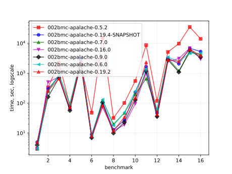
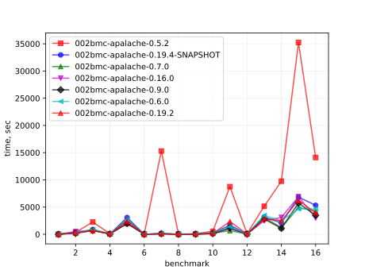
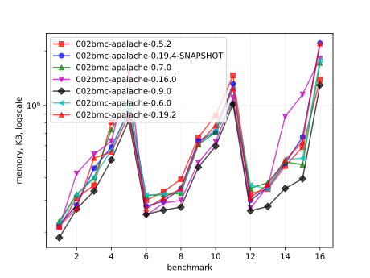
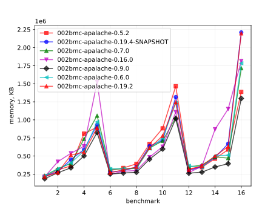

# Results of 002bmc-apalache

## 1. Awesome plots

### 1.1. Time (logarithmic scale)

### 1.2. Time (linear)

### 1.3. Memory (logarithmic scale)

### 1.4. Memory (linear)

### 1.5. Number of arena cells (linear)

### 1.6. Number of SMT clauses (linear)

## 2. Input parameters

no  |  filename                            |  tool      |  timeout  |  init  |  inv                |  next  |  args
----|--------------------------------------|------------|-----------|--------|---------------------|--------|---------------------------------
1   |  traffic/APAtraffic.tla              |  apalache  |  1h       |        |                     |        |  --length=4
2   |  Prisoners/APAPrisoners.tla          |  apalache  |  30m      |        |  SafetyInv          |        |  --length=15 --cinit=ConstInit
3   |  Bakery-Boulangerie/APABakery.tla    |  apalache  |  10h      |        |  MutualExclusion    |        |  --length=8
4   |  ewd840/APAEWD840.tla                |  apalache  |  1h       |        |  Inv                |        |  --length=12 --cinit=ConstInit4
5   |  ewd840/APAEWD840.tla                |  apalache  |  5h       |        |  Inv                |        |  --length=30 --cinit=ConstInit10
6   |  allocator/APASimpleAllocator.tla    |  apalache  |  10h      |        |  ResourceMutex      |        |  --length=7 --cinit=ConstInit22
7   |  allocator/APASimpleAllocator.tla    |  apalache  |  23h      |        |  ResourceMutex      |        |  --length=7 --cinit=ConstInit53
8   |  bcastFolklore/APAbcastFolklore.tla  |  apalache  |  30m      |  Init  |                     |        |  --length=10 --cinit=ConstInit4
9   |  bcastFolklore/APAbcastFolklore.tla  |  apalache  |  30m      |  Init  |                     |        |  --length=10 --cinit=ConstInit20
10  |  bcastByz/APAbcastByz.tla            |  apalache  |  30m      |  Init  |                     |        |  --length=10 --cinit=ConstInit4
11  |  bcastByz/APAbcastByz.tla            |  apalache  |  23h      |  Init  |                     |        |  --length=11 --cinit=ConstInit6
12  |  two-phase/APATwoPhase.tla           |  apalache  |  23h      |        |  TCConsistent       |        |  --length=11 --cinit=ConstInit3
13  |  two-phase/APATwoPhase.tla           |  apalache  |  23h      |        |  TCConsistent       |        |  --length=10 --cinit=ConstInit7
14  |  paxos/Apa3Paxos.tla                 |  apalache  |  23h      |        |  OneValuePerBallot  |        |  --length=13
15  |  paxos/Apa5Paxos.tla                 |  apalache  |  23h      |        |  OneValuePerBallot  |        |  --length=14
16  |  raft/APAraft.tla                    |  apalache  |  23h      |        |  OneLeader          |        |  --length=8

## 3. Detailed results: 002bmc-apalache-0.7.0.csv

01:no  |  02:tool   |  03:status  |  04:time_sec  |  05:depth  |  05:mem_kb  |  10:ninit_trans  |  11:ninit_trans  |  12:ncells  |  13:nclauses  |  14:navg_clause_len
-------|------------|-------------|---------------|------------|-------------|------------------|------------------|-------------|---------------|--------------------
1      |  apalache  |  NoError    |  9s           |  4         |  63MB       |  0               |  0               |  514        |  1.0K         |  8.0
2      |  apalache  |  NoError    |  2m02s        |  15        |  61MB       |  0               |  0               |  3.0K       |  7.0K         |  10
3      |  apalache  |  NoError    |  7m07s        |  8         |  65MB       |  0               |  0               |  13K        |  37K          |  11
4      |  apalache  |  NoError    |  47s          |  12        |  63MB       |  0               |  0               |  35K        |  243K         |  12
5      |  apalache  |  NoError    |  23m          |  30        |  63MB       |  0               |  0               |  86K        |  597K         |  12
6      |  apalache  |  NoError    |  4s           |  7         |  63MB       |  0               |  0               |  2.0K       |  5.0K         |  11
7      |  apalache  |  NoError    |  59s          |  7         |  65MB       |  0               |  0               |  3.0K       |  18K          |  14
8      |  apalache  |  NoError    |  7s           |  10        |  63MB       |  0               |  0               |  7.0K       |  22K          |  12
9      |  apalache  |  NoError    |  17s          |  10        |  61MB       |  0               |  0               |  27K        |  105K         |  14
10     |  apalache  |  NoError    |  1m01s        |  10        |  63MB       |  0               |  0               |  39K        |  161K         |  14
11     |  apalache  |  NoError    |  14m          |  11        |  61MB       |  0               |  0               |  75K        |  391K         |  15
12     |  apalache  |  NoError    |  27s          |  11        |  63MB       |  0               |  0               |  3.0K       |  10K          |  11
13     |  apalache  |  NoError    |  41m          |  10        |  64MB       |  0               |  0               |  4.0K       |  16K          |  11
14     |  apalache  |  NoError    |  12m          |  13        |  61MB       |  0               |  0               |  18K        |  44K          |  11
15     |  apalache  |  NoError    |  1h01m        |  14        |  63MB       |  0               |  0               |  28K        |  71K          |  11
16     |  apalache  |  NoError    |  46m          |  8         |  63MB       |  0               |  0               |  68K        |  253K         |  25

## 4. Detailed results: 002bmc-apalache-0.6.1.csv

01:no  |  02:tool   |  03:status  |  04:time_sec  |  05:depth  |  05:mem_kb  |  10:ninit_trans  |  11:ninit_trans  |  12:ncells  |  13:nclauses  |  14:navg_clause_len
-------|------------|-------------|---------------|------------|-------------|------------------|------------------|-------------|---------------|--------------------
1      |  apalache  |  NoError    |  10s          |  4         |  61MB       |  0               |  0               |  514        |  1.0K         |  8.0
2      |  apalache  |  NoError    |  2m02s        |  15        |  63MB       |  0               |  0               |  3.0K       |  7.0K         |  10
3      |  apalache  |  NoError    |  10m          |  8         |  62MB       |  0               |  0               |  13K        |  37K          |  11
4      |  apalache  |  NoError    |  49s          |  12        |  61MB       |  0               |  0               |  27K        |  152K         |  12
5      |  apalache  |  NoError    |  29m          |  30        |  63MB       |  0               |  0               |  67K        |  372K         |  12
6      |  apalache  |  NoError    |  5s           |  7         |  65MB       |  0               |  0               |  2.0K       |  5.0K         |  11
7      |  apalache  |  NoError    |  1m01s        |  7         |  63MB       |  0               |  0               |  3.0K       |  18K          |  14
8      |  apalache  |  NoError    |  9s           |  10        |  63MB       |  0               |  0               |  7.0K       |  22K          |  12
9      |  apalache  |  NoError    |  23s          |  10        |  63MB       |  0               |  0               |  27K        |  105K         |  14
10     |  apalache  |  NoError    |  1m01s        |  10        |  63MB       |  0               |  0               |  39K        |  161K         |  14
11     |  apalache  |  NoError    |  15m          |  11        |  63MB       |  0               |  0               |  75K        |  391K         |  15
12     |  apalache  |  NoError    |  36s          |  11        |  63MB       |  0               |  0               |  3.0K       |  10K          |  11
13     |  apalache  |  NoError    |  43m          |  10        |  63MB       |  0               |  0               |  4.0K       |  16K          |  11
14     |  apalache  |  NoError    |  29m          |  13        |  65MB       |  0               |  0               |  18K        |  44K          |  11
15     |  apalache  |  NoError    |  58m          |  14        |  61MB       |  0               |  0               |  28K        |  71K          |  11
16     |  apalache  |  NoError    |  50m          |  8         |  63MB       |  0               |  0               |  68K        |  253K         |  25
