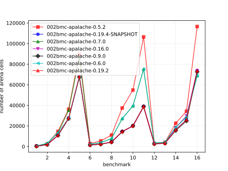

# Results of 002bmc-apalache

## 1. Awesome plots

### 1.1. Time (logarithmic scale)

### 1.2. Time (linear)

### 1.3. Memory (logarithmic scale)

### 1.4. Memory (linear)

### 1.5. Number of arena cells (linear)

### 1.6. Number of SMT clauses (linear)

## 2. Input parameters

no  |  filename                            |  tool      |  timeout  |  init  |  inv                |  next  |  args
----|--------------------------------------|------------|-----------|--------|---------------------|--------|---------------------------------
1   |  traffic/APAtraffic.tla              |  apalache  |  1h       |        |                     |        |  --length=4
2   |  Prisoners/APAPrisoners.tla          |  apalache  |  30m      |        |  SafetyInv          |        |  --length=15 --cinit=ConstInit
3   |  Bakery-Boulangerie/APABakery.tla    |  apalache  |  10h      |        |  MutualExclusion    |        |  --length=8
4   |  ewd840/APAEWD840.tla                |  apalache  |  1h       |        |  Inv                |        |  --length=12 --cinit=ConstInit4
5   |  ewd840/APAEWD840.tla                |  apalache  |  5h       |        |  Inv                |        |  --length=30 --cinit=ConstInit10
6   |  allocator/APASimpleAllocator.tla    |  apalache  |  10h      |        |  ResourceMutex      |        |  --length=7 --cinit=ConstInit22
7   |  allocator/APASimpleAllocator.tla    |  apalache  |  23h      |        |  ResourceMutex      |        |  --length=7 --cinit=ConstInit53
8   |  bcastFolklore/APAbcastFolklore.tla  |  apalache  |  30m      |  Init  |                     |        |  --length=10 --cinit=ConstInit4
9   |  bcastFolklore/APAbcastFolklore.tla  |  apalache  |  30m      |  Init  |                     |        |  --length=10 --cinit=ConstInit20
10  |  bcastByz/APAbcastByz.tla            |  apalache  |  30m      |  Init  |                     |        |  --length=10 --cinit=ConstInit4
11  |  bcastByz/APAbcastByz.tla            |  apalache  |  23h      |  Init  |                     |        |  --length=11 --cinit=ConstInit6
12  |  two-phase/APATwoPhase.tla           |  apalache  |  23h      |        |  TCConsistent       |        |  --length=11 --cinit=ConstInit3
13  |  two-phase/APATwoPhase.tla           |  apalache  |  23h      |        |  TCConsistent       |        |  --length=10 --cinit=ConstInit7
14  |  paxos/Apa3Paxos.tla                 |  apalache  |  23h      |        |  OneValuePerBallot  |        |  --length=13
15  |  paxos/Apa5Paxos.tla                 |  apalache  |  23h      |        |  OneValuePerBallot  |        |  --length=14
16  |  raft/APAraft.tla                    |  apalache  |  23h      |        |  OneLeader          |        |  --length=8

## 3. Detailed results: 002bmc-apalache-0.6.0.csv

01:no  |  02:tool   |  03:status  |  04:time_sec  |  05:depth  |  05:mem_kb  |  10:ninit_trans  |  11:ninit_trans  |  12:ncells  |  13:nclauses  |  14:navg_clause_len
-------|------------|-------------|---------------|------------|-------------|------------------|------------------|-------------|---------------|--------------------
1      |  apalache  |  NoError    |  3s           |  4         |  222MB      |  0               |  0               |  514        |  1.0K         |  8.0
2      |  apalache  |  NoError    |  4m04s        |  15        |  309MB      |  0               |  0               |  3.0K       |  7.0K         |  10
3      |  apalache  |  NoError    |  15m          |  8         |  382MB      |  0               |  0               |  13K        |  37K          |  11
4      |  apalache  |  NoError    |  1m01s        |  12        |  547MB      |  0               |  0               |  27K        |  152K         |  12
5      |  apalache  |  NoError    |  50m          |  30        |  730MB      |  0               |  0               |  67K        |  372K         |  12
6      |  apalache  |  NoError    |  10s          |  7         |  300MB      |  0               |  0               |  2.0K       |  5.0K         |  11
7      |  apalache  |  NoError    |  2m02s        |  7         |  314MB      |  0               |  0               |  3.0K       |  18K          |  14
8      |  apalache  |  NoError    |  22s          |  10        |  330MB      |  0               |  0               |  7.0K       |  22K          |  12
9      |  apalache  |  NoError    |  53s          |  10        |  610MB      |  0               |  0               |  27K        |  105K         |  14
10     |  apalache  |  NoError    |  3m03s        |  10        |  776MB      |  0               |  0               |  39K        |  161K         |  14
11     |  apalache  |  NoError    |  26m          |  11        |  1.0GB      |  0               |  0               |  75K        |  391K         |  15
12     |  apalache  |  NoError    |  1m01s        |  11        |  311MB      |  0               |  0               |  3.0K       |  10K          |  11
13     |  apalache  |  NoError    |  1h01m        |  10        |  323MB      |  0               |  0               |  4.0K       |  16K          |  11
14     |  apalache  |  NoError    |  40m          |  13        |  450MB      |  0               |  0               |  18K        |  44K          |  11
15     |  apalache  |  NoError    |  1h01m        |  14        |  464MB      |  0               |  0               |  28K        |  71K          |  11
16     |  apalache  |  NoError    |  1h01m        |  8         |  1.0GB      |  0               |  0               |  68K        |  253K         |  25

## 4. Detailed results: 002bmc-apalache-0.5.2.csv

01:no  |  02:tool   |  03:status  |  04:time_sec  |  05:depth  |  05:mem_kb  |  10:ninit_trans  |  11:ninit_trans  |  12:ncells  |  13:nclauses  |  14:navg_clause_len
-------|------------|-------------|---------------|------------|-------------|------------------|------------------|-------------|---------------|--------------------
1      |  apalache  |  NoError    |  3s           |  4         |  210MB      |  1               |  4               |  501        |  999          |  8.0
2      |  apalache  |  NoError    |  6m06s        |  15        |  302MB      |  1               |  4               |  2.0K       |  6.0K         |  11
3      |  apalache  |  NoError    |  40m          |  8         |  369MB      |  1               |  16              |  14K        |  48K          |  11
4      |  apalache  |  NoError    |  1m01s        |  12        |  781MB      |  1               |  4               |  36K        |  257K         |  12
5      |  apalache  |  NoError    |  55m          |  30        |  989MB      |  1               |  4               |  89K        |  635K         |  12
6      |  apalache  |  NoError    |  1m01s        |  7         |  292MB      |  1               |  3               |  2.0K       |  9.0K         |  13
7      |  apalache  |  NoError    |  5h05m        |  7         |  341MB      |  1               |  3               |  5.0K       |  30K          |  16
8      |  apalache  |  NoError    |  32s          |  10        |  432MB      |  1               |  4               |  11K        |  33K          |  13
9      |  apalache  |  NoError    |  2m02s        |  10        |  689MB      |  1               |  4               |  37K        |  141K         |  13
10     |  apalache  |  NoError    |  8m08s        |  10        |  840MB      |  1               |  5               |  54K        |  216K         |  14
11     |  apalache  |  NoError    |  3h03m        |  11        |  1.0GB      |  1               |  5               |  106K       |  543K         |  15
12     |  apalache  |  NoError    |  1m01s        |  11        |  302MB      |  1               |  7               |  3.0K       |  10K          |  10
13     |  apalache  |  NoError    |  1h01m        |  10        |  339MB      |  1               |  7               |  4.0K       |  15K          |  10
14     |  apalache  |  NoError    |  2h02m        |  13        |  486MB      |  1               |  4               |  22K        |  50K          |  10
15     |  apalache  |  NoError    |  11h          |  14        |  578MB      |  1               |  4               |  34K        |  79K          |  10
16     |  apalache  |  NoError    |  3h03m        |  8         |  1.0GB      |  1               |  23              |  116K       |  445K         |  19
