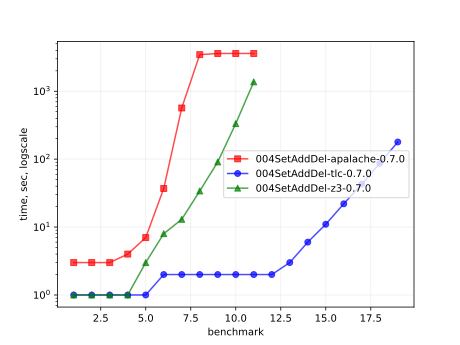
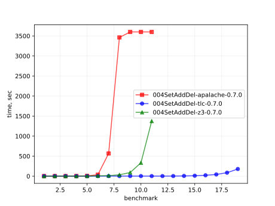
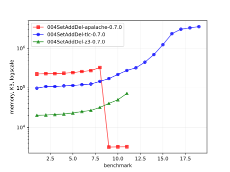
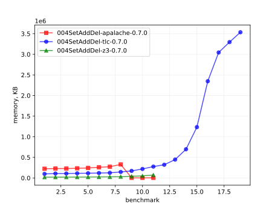

# Results of 004SetAddDel

### 1. Time (logarithmic scale)

### 2. Time (linear)

### 3. Memory (logarithmic scale)

### 4. Memory (linear)

## 5. Detailed results: 004SetAddDel-z3-0.7.0.csv

01:no  |  02:tool  |  03:status  |  04:time_sec  |  05:mem_kb
-------|-----------|-------------|---------------|-----------
