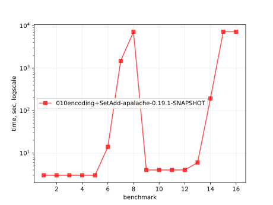
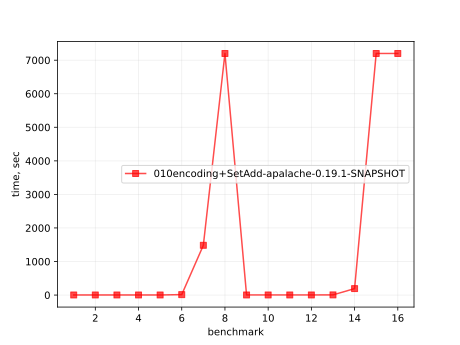
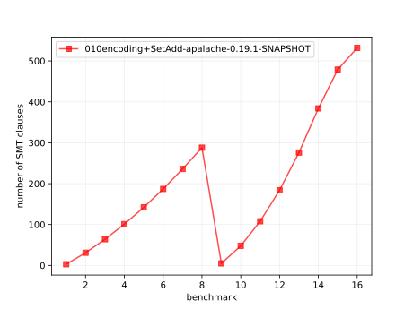

# Results of 010encoding+SetAdd-apalache

## 1. Awesome plots

### 1.1. Time (logarithmic scale)

### 1.2. Time (linear)

### 1.3. Memory (logarithmic scale)

### 1.4. Memory (linear)

### 1.5. Number of arena cells (linear)

### 1.6. Number of SMT clauses (linear)

## 2. Input parameters

no  |  filename                   |  tool      |  timeout  |  init  |  inv  |  next  |  args
----|-----------------------------|------------|-----------|--------|-------|--------|-----------------------------------------------------
1   |  array-encoding/SetAdd.tla  |  apalache  |  2h       |  Init  |  Inv  |  Next  |  --smt-encoding=arrays --length=0 --cinit=CInit0
2   |  array-encoding/SetAdd.tla  |  apalache  |  2h       |  Init  |  Inv  |  Next  |  --smt-encoding=arrays --length=2 --cinit=CInit2
3   |  array-encoding/SetAdd.tla  |  apalache  |  2h       |  Init  |  Inv  |  Next  |  --smt-encoding=arrays --length=4 --cinit=CInit4
4   |  array-encoding/SetAdd.tla  |  apalache  |  2h       |  Init  |  Inv  |  Next  |  --smt-encoding=arrays --length=6 --cinit=CInit6
5   |  array-encoding/SetAdd.tla  |  apalache  |  2h       |  Init  |  Inv  |  Next  |  --smt-encoding=arrays --length=8 --cinit=CInit8
6   |  array-encoding/SetAdd.tla  |  apalache  |  2h       |  Init  |  Inv  |  Next  |  --smt-encoding=arrays --length=10 --cinit=CInit10
7   |  array-encoding/SetAdd.tla  |  apalache  |  2h       |  Init  |  Inv  |  Next  |  --smt-encoding=arrays --length=12 --cinit=CInit12
8   |  array-encoding/SetAdd.tla  |  apalache  |  2h       |  Init  |  Inv  |  Next  |  --smt-encoding=arrays --length=14 --cinit=CInit14
9   |  array-encoding/SetAdd.tla  |  apalache  |  2h       |  Init  |  Inv  |  Next  |  --smt-encoding=oopsla19 --length=0 --cinit=CInit0
10  |  array-encoding/SetAdd.tla  |  apalache  |  2h       |  Init  |  Inv  |  Next  |  --smt-encoding=oopsla19 --length=2 --cinit=CInit2
11  |  array-encoding/SetAdd.tla  |  apalache  |  2h       |  Init  |  Inv  |  Next  |  --smt-encoding=oopsla19 --length=4 --cinit=CInit4
12  |  array-encoding/SetAdd.tla  |  apalache  |  2h       |  Init  |  Inv  |  Next  |  --smt-encoding=oopsla19 --length=6 --cinit=CInit6
13  |  array-encoding/SetAdd.tla  |  apalache  |  2h       |  Init  |  Inv  |  Next  |  --smt-encoding=oopsla19 --length=8 --cinit=CInit8
14  |  array-encoding/SetAdd.tla  |  apalache  |  2h       |  Init  |  Inv  |  Next  |  --smt-encoding=oopsla19 --length=10 --cinit=CInit10
15  |  array-encoding/SetAdd.tla  |  apalache  |  2h       |  Init  |  Inv  |  Next  |  --smt-encoding=oopsla19 --length=12 --cinit=CInit12
16  |  array-encoding/SetAdd.tla  |  apalache  |  2h       |  Init  |  Inv  |  Next  |  --smt-encoding=oopsla19 --length=14 --cinit=CInit14

## 3. Detailed results: 010encoding+SetAdd-apalache-0.19.1-SNAPSHOT.csv

01:no  |  02:tool   |  03:status  |  04:time_sec  |  05:depth  |  05:mem_kb  |  10:ninit_trans  |  11:ninit_trans  |  12:ncells  |  13:nclauses  |  14:navg_clause_len
-------|------------|-------------|---------------|------------|-------------|------------------|------------------|-------------|---------------|--------------------
1      |  apalache  |  NoError    |  3s           |  0         |  194MB      |  0               |  0               |  4.0        |  3.0          |  5.0
2      |  apalache  |  NoError    |  3s           |  0         |  191MB      |  0               |  0               |  26         |  31           |  10
3      |  apalache  |  NoError    |  3s           |  0         |  191MB      |  0               |  0               |  48         |  64           |  14
4      |  apalache  |  NoError    |  3s           |  0         |  197MB      |  0               |  0               |  70         |  101          |  17
5      |  apalache  |  NoError    |  3s           |  0         |  201MB      |  0               |  0               |  92         |  142          |  19
6      |  apalache  |  NoError    |  14s          |  0         |  203MB      |  0               |  0               |  114        |  187          |  22
7      |  apalache  |  NoError    |  24m          |  0         |  270MB      |  0               |  0               |  136        |  236          |  24
8      |  apalache  |  Timeout    |  2h02m        |  0         |  3.0MB      |  0               |  0               |  157        |  288          |  26
9      |  apalache  |  NoError    |  4s           |  0         |  193MB      |  0               |  0               |  5.0        |  5.0          |  6.0
10     |  apalache  |  NoError    |  4s           |  0         |  194MB      |  0               |  0               |  40         |  48           |  12
11     |  apalache  |  NoError    |  4s           |  0         |  199MB      |  0               |  0               |  87         |  108          |  18
12     |  apalache  |  NoError    |  4s           |  0         |  198MB      |  0               |  0               |  146        |  184          |  24
13     |  apalache  |  NoError    |  6s           |  0         |  202MB      |  0               |  0               |  217        |  276          |  30
14     |  apalache  |  NoError    |  3m03s        |  0         |  236MB      |  0               |  0               |  300        |  384          |  37
15     |  apalache  |  Timeout    |  2h02m        |  0         |  3.0MB      |  0               |  0               |  367        |  479          |  42
16     |  apalache  |  Timeout    |  2h02m        |  0         |  3.0MB      |  0               |  0               |  393        |  532          |  42
