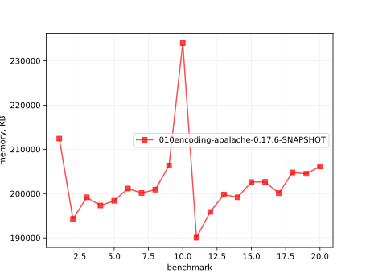

# Results of 010encoding-apalache

## 1. Awesome plots

### 1.1. Time (logarithmic scale)

### 1.2. Time (linear)

### 1.3. Memory (logarithmic scale)

### 1.4. Memory (linear)

### 1.5. Number of arena cells (linear)

### 1.6. Number of SMT clauses (linear)

## 2. Input parameters

no  |  filename                   |  tool      |  timeout  |  init  |  inv  |  next  |  args
----|-----------------------------|------------|-----------|--------|-------|--------|-----------------------------------------------------
1   |  array-encoding/SetAdd.tla  |  apalache  |  5m       |  Init  |  Inv  |  Next  |  --smt-encoding=oopsla19 --length=1 --cinit=CInit1
2   |  array-encoding/SetAdd.tla  |  apalache  |  5m       |  Init  |  Inv  |  Next  |  --smt-encoding=oopsla19 --length=2 --cinit=CInit2
3   |  array-encoding/SetAdd.tla  |  apalache  |  5m       |  Init  |  Inv  |  Next  |  --smt-encoding=oopsla19 --length=3 --cinit=CInit3
4   |  array-encoding/SetAdd.tla  |  apalache  |  5m       |  Init  |  Inv  |  Next  |  --smt-encoding=oopsla19 --length=4 --cinit=CInit4
5   |  array-encoding/SetAdd.tla  |  apalache  |  5m       |  Init  |  Inv  |  Next  |  --smt-encoding=oopsla19 --length=5 --cinit=CInit5
6   |  array-encoding/SetAdd.tla  |  apalache  |  5m       |  Init  |  Inv  |  Next  |  --smt-encoding=oopsla19 --length=6 --cinit=CInit6
7   |  array-encoding/SetAdd.tla  |  apalache  |  5m       |  Init  |  Inv  |  Next  |  --smt-encoding=oopsla19 --length=7 --cinit=CInit7
8   |  array-encoding/SetAdd.tla  |  apalache  |  5m       |  Init  |  Inv  |  Next  |  --smt-encoding=oopsla19 --length=8 --cinit=CInit8
9   |  array-encoding/SetAdd.tla  |  apalache  |  5m       |  Init  |  Inv  |  Next  |  --smt-encoding=oopsla19 --length=9 --cinit=CInit9
10  |  array-encoding/SetAdd.tla  |  apalache  |  5m       |  Init  |  Inv  |  Next  |  --smt-encoding=oopsla19 --length=10 --cinit=CInit10
11  |  array-encoding/SetAdd.tla  |  apalache  |  5m       |  Init  |  Inv  |  Next  |  --smt-encoding=arrays --length=1 --cinit=CInit1
12  |  array-encoding/SetAdd.tla  |  apalache  |  5m       |  Init  |  Inv  |  Next  |  --smt-encoding=arrays --length=2 --cinit=CInit2
13  |  array-encoding/SetAdd.tla  |  apalache  |  5m       |  Init  |  Inv  |  Next  |  --smt-encoding=arrays --length=3 --cinit=CInit3
14  |  array-encoding/SetAdd.tla  |  apalache  |  5m       |  Init  |  Inv  |  Next  |  --smt-encoding=arrays --length=4 --cinit=CInit4
15  |  array-encoding/SetAdd.tla  |  apalache  |  5m       |  Init  |  Inv  |  Next  |  --smt-encoding=arrays --length=5 --cinit=CInit5
16  |  array-encoding/SetAdd.tla  |  apalache  |  5m       |  Init  |  Inv  |  Next  |  --smt-encoding=arrays --length=6 --cinit=CInit6
17  |  array-encoding/SetAdd.tla  |  apalache  |  5m       |  Init  |  Inv  |  Next  |  --smt-encoding=arrays --length=7 --cinit=CInit7
18  |  array-encoding/SetAdd.tla  |  apalache  |  5m       |  Init  |  Inv  |  Next  |  --smt-encoding=arrays --length=8 --cinit=CInit8
19  |  array-encoding/SetAdd.tla  |  apalache  |  5m       |  Init  |  Inv  |  Next  |  --smt-encoding=arrays --length=9 --cinit=CInit9
20  |  array-encoding/SetAdd.tla  |  apalache  |  5m       |  Init  |  Inv  |  Next  |  --smt-encoding=arrays --length=10 --cinit=CInit10

## 3. Detailed results: 010encoding-apalache-0.17.6-SNAPSHOT.csv

01:no  |  02:tool   |  03:status  |  04:time_sec  |  05:depth  |  05:mem_kb  |  10:ninit_trans  |  11:ninit_trans  |  12:ncells  |  13:nclauses  |  14:navg_clause_len
-------|------------|-------------|---------------|------------|-------------|------------------|------------------|-------------|---------------|--------------------
1      |  apalache  |  Error      |  3s           |  0         |  207MB      |  0               |  0               |  17         |  19           |  7.0
2      |  apalache  |  Error      |  3s           |  0         |  189MB      |  0               |  0               |  36         |  43           |  10
3      |  apalache  |  Error      |  3s           |  0         |  194MB      |  0               |  0               |  57         |  71           |  13
4      |  apalache  |  Error      |  3s           |  0         |  192MB      |  0               |  0               |  81         |  104          |  15
5      |  apalache  |  Error      |  3s           |  0         |  193MB      |  0               |  0               |  108        |  142          |  18
6      |  apalache  |  Error      |  3s           |  0         |  196MB      |  0               |  0               |  138        |  185          |  21
7      |  apalache  |  Error      |  3s           |  0         |  195MB      |  0               |  0               |  171        |  233          |  24
8      |  apalache  |  Error      |  3s           |  0         |  196MB      |  0               |  0               |  207        |  286          |  26
9      |  apalache  |  Error      |  5s           |  0         |  201MB      |  0               |  0               |  246        |  344          |  29
10     |  apalache  |  Error      |  23s          |  0         |  228MB      |  0               |  0               |  288        |  407          |  32
11     |  apalache  |  Error      |  4s           |  0         |  185MB      |  0               |  0               |  12         |  12           |  6.0
12     |  apalache  |  Error      |  4s           |  0         |  191MB      |  0               |  0               |  24         |  28           |  9.0
13     |  apalache  |  Error      |  4s           |  0         |  195MB      |  0               |  0               |  35         |  45           |  10
14     |  apalache  |  Error      |  4s           |  0         |  194MB      |  0               |  0               |  46         |  64           |  12
15     |  apalache  |  Error      |  4s           |  0         |  197MB      |  0               |  0               |  57         |  85           |  13
16     |  apalache  |  Error      |  3s           |  0         |  197MB      |  0               |  0               |  68         |  108          |  14
17     |  apalache  |  Error      |  3s           |  0         |  195MB      |  0               |  0               |  79         |  133          |  15
18     |  apalache  |  Error      |  4s           |  0         |  199MB      |  0               |  0               |  90         |  160          |  16
19     |  apalache  |  Error      |  4s           |  0         |  199MB      |  0               |  0               |  101        |  189          |  16
20     |  apalache  |  Error      |  5s           |  0         |  201MB      |  0               |  0               |  112        |  220          |  17
