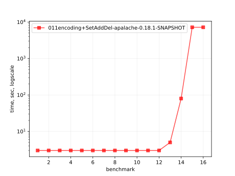
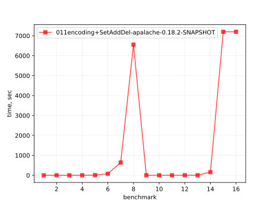
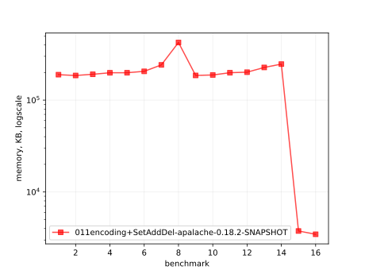
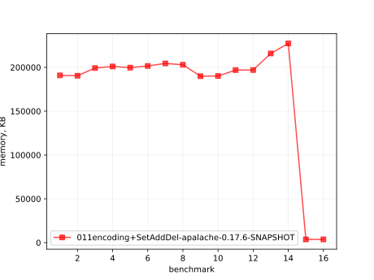
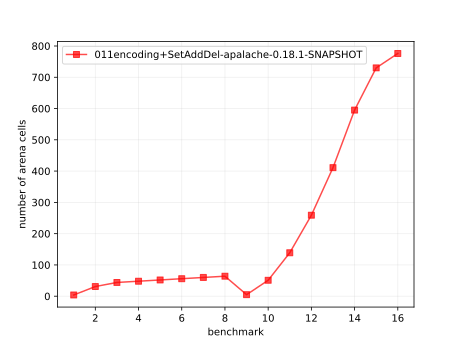
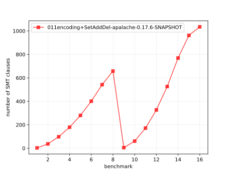

# Results of 011encoding+SetAddDel-apalache

## 1. Awesome plots

### 1.1. Time (logarithmic scale)

### 1.2. Time (linear)

### 1.3. Memory (logarithmic scale)

### 1.4. Memory (linear)

### 1.5. Number of arena cells (linear)

### 1.6. Number of SMT clauses (linear)

## 2. Input parameters

no  |  filename                      |  tool      |  timeout  |  init  |  inv  |  next  |  args
----|--------------------------------|------------|-----------|--------|-------|--------|-----------------------------------------------------
1   |  array-encoding/SetAddDel.tla  |  apalache  |  2h       |  Init  |  Inv  |  Next  |  --smt-encoding=arrays --length=0 --cinit=CInit0
2   |  array-encoding/SetAddDel.tla  |  apalache  |  2h       |  Init  |  Inv  |  Next  |  --smt-encoding=arrays --length=2 --cinit=CInit2
3   |  array-encoding/SetAddDel.tla  |  apalache  |  2h       |  Init  |  Inv  |  Next  |  --smt-encoding=arrays --length=4 --cinit=CInit4
4   |  array-encoding/SetAddDel.tla  |  apalache  |  2h       |  Init  |  Inv  |  Next  |  --smt-encoding=arrays --length=6 --cinit=CInit6
5   |  array-encoding/SetAddDel.tla  |  apalache  |  2h       |  Init  |  Inv  |  Next  |  --smt-encoding=arrays --length=8 --cinit=CInit8
6   |  array-encoding/SetAddDel.tla  |  apalache  |  2h       |  Init  |  Inv  |  Next  |  --smt-encoding=arrays --length=10 --cinit=CInit10
7   |  array-encoding/SetAddDel.tla  |  apalache  |  2h       |  Init  |  Inv  |  Next  |  --smt-encoding=arrays --length=12 --cinit=CInit12
8   |  array-encoding/SetAddDel.tla  |  apalache  |  2h       |  Init  |  Inv  |  Next  |  --smt-encoding=arrays --length=14 --cinit=CInit14
9   |  array-encoding/SetAddDel.tla  |  apalache  |  2h       |  Init  |  Inv  |  Next  |  --smt-encoding=oopsla19 --length=0 --cinit=CInit0
10  |  array-encoding/SetAddDel.tla  |  apalache  |  2h       |  Init  |  Inv  |  Next  |  --smt-encoding=oopsla19 --length=2 --cinit=CInit2
11  |  array-encoding/SetAddDel.tla  |  apalache  |  2h       |  Init  |  Inv  |  Next  |  --smt-encoding=oopsla19 --length=4 --cinit=CInit4
12  |  array-encoding/SetAddDel.tla  |  apalache  |  2h       |  Init  |  Inv  |  Next  |  --smt-encoding=oopsla19 --length=6 --cinit=CInit6
13  |  array-encoding/SetAddDel.tla  |  apalache  |  2h       |  Init  |  Inv  |  Next  |  --smt-encoding=oopsla19 --length=8 --cinit=CInit8
14  |  array-encoding/SetAddDel.tla  |  apalache  |  2h       |  Init  |  Inv  |  Next  |  --smt-encoding=oopsla19 --length=10 --cinit=CInit10
15  |  array-encoding/SetAddDel.tla  |  apalache  |  2h       |  Init  |  Inv  |  Next  |  --smt-encoding=oopsla19 --length=12 --cinit=CInit12
16  |  array-encoding/SetAddDel.tla  |  apalache  |  2h       |  Init  |  Inv  |  Next  |  --smt-encoding=oopsla19 --length=14 --cinit=CInit14

## 3. Detailed results: 011encoding+SetAddDel-apalache-0.19.1-SNAPSHOT.csv

01:no  |  02:tool   |  03:status  |  04:time_sec  |  05:depth  |  05:mem_kb  |  10:ninit_trans  |  11:ninit_trans  |  12:ncells  |  13:nclauses  |  14:navg_clause_len
-------|------------|-------------|---------------|------------|-------------|------------------|------------------|-------------|---------------|--------------------
1      |  apalache  |  NoError    |  3s           |  0         |  188MB      |  0               |  0               |  4.0        |  3.0          |  5.0
2      |  apalache  |  NoError    |  3s           |  0         |  193MB      |  0               |  0               |  31         |  37           |  11
3      |  apalache  |  NoError    |  3s           |  0         |  216MB      |  0               |  0               |  73         |  92           |  14
4      |  apalache  |  NoError    |  4s           |  0         |  224MB      |  0               |  0               |  123        |  159          |  16
5      |  apalache  |  NoError    |  9s           |  0         |  205MB      |  0               |  0               |  181        |  238          |  18
6      |  apalache  |  NoError    |  40s          |  0         |  209MB      |  0               |  0               |  247        |  329          |  19
7      |  apalache  |  NoError    |  9m09s        |  0         |  226MB      |  0               |  0               |  321        |  432          |  20
8      |  apalache  |  NoError    |  1h01m        |  0         |  348MB      |  0               |  0               |  403        |  547          |  22
9      |  apalache  |  NoError    |  4s           |  0         |  191MB      |  0               |  0               |  5.0        |  5.0          |  6.0
10     |  apalache  |  NoError    |  5s           |  0         |  189MB      |  0               |  0               |  51         |  61           |  12
11     |  apalache  |  NoError    |  5s           |  0         |  203MB      |  0               |  0               |  139        |  166          |  18
12     |  apalache  |  NoError    |  5s           |  0         |  230MB      |  0               |  0               |  259        |  307          |  23
13     |  apalache  |  NoError    |  7s           |  0         |  237MB      |  0               |  0               |  411        |  484          |  29
14     |  apalache  |  NoError    |  1m01s        |  0         |  229MB      |  0               |  0               |  595        |  697          |  36
15     |  apalache  |  Timeout    |  2h02m        |  0         |  3.0MB      |  0               |  0               |  730        |  862          |  40
16     |  apalache  |  Timeout    |  2h02m        |  0         |  3.0MB      |  0               |  0               |  776        |  935          |  42
