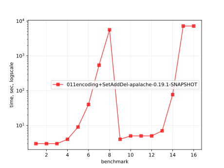
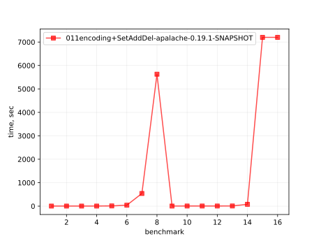
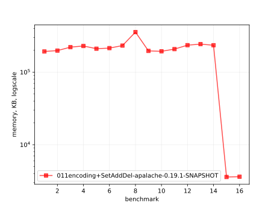
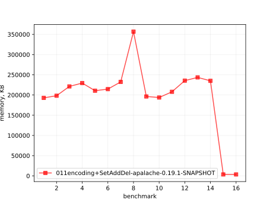
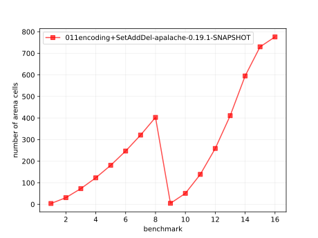
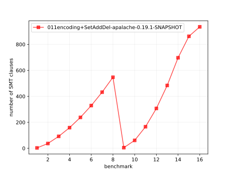

# Results of 011encoding+SetAddDel-apalache

## 1. Awesome plots

### 1.1. Time (logarithmic scale)

### 1.2. Time (linear)

### 1.3. Memory (logarithmic scale)

### 1.4. Memory (linear)

### 1.5. Number of arena cells (linear)

### 1.6. Number of SMT clauses (linear)

## 2. Input parameters

no  |  filename                      |  tool      |  timeout  |  init  |  inv  |  next  |  args
----|--------------------------------|------------|-----------|--------|-------|--------|-----------------------------------------------------
1   |  array-encoding/SetAddDel.tla  |  apalache  |  2h       |  Init  |  Inv  |  Next  |  --smt-encoding=arrays --length=0 --cinit=CInit0
2   |  array-encoding/SetAddDel.tla  |  apalache  |  2h       |  Init  |  Inv  |  Next  |  --smt-encoding=arrays --length=2 --cinit=CInit2
3   |  array-encoding/SetAddDel.tla  |  apalache  |  2h       |  Init  |  Inv  |  Next  |  --smt-encoding=arrays --length=4 --cinit=CInit4
4   |  array-encoding/SetAddDel.tla  |  apalache  |  2h       |  Init  |  Inv  |  Next  |  --smt-encoding=arrays --length=6 --cinit=CInit6
5   |  array-encoding/SetAddDel.tla  |  apalache  |  2h       |  Init  |  Inv  |  Next  |  --smt-encoding=arrays --length=8 --cinit=CInit8
6   |  array-encoding/SetAddDel.tla  |  apalache  |  2h       |  Init  |  Inv  |  Next  |  --smt-encoding=arrays --length=10 --cinit=CInit10
7   |  array-encoding/SetAddDel.tla  |  apalache  |  2h       |  Init  |  Inv  |  Next  |  --smt-encoding=arrays --length=12 --cinit=CInit12
8   |  array-encoding/SetAddDel.tla  |  apalache  |  2h       |  Init  |  Inv  |  Next  |  --smt-encoding=arrays --length=14 --cinit=CInit14
9   |  array-encoding/SetAddDel.tla  |  apalache  |  2h       |  Init  |  Inv  |  Next  |  --smt-encoding=oopsla19 --length=0 --cinit=CInit0
10  |  array-encoding/SetAddDel.tla  |  apalache  |  2h       |  Init  |  Inv  |  Next  |  --smt-encoding=oopsla19 --length=2 --cinit=CInit2
11  |  array-encoding/SetAddDel.tla  |  apalache  |  2h       |  Init  |  Inv  |  Next  |  --smt-encoding=oopsla19 --length=4 --cinit=CInit4
12  |  array-encoding/SetAddDel.tla  |  apalache  |  2h       |  Init  |  Inv  |  Next  |  --smt-encoding=oopsla19 --length=6 --cinit=CInit6
13  |  array-encoding/SetAddDel.tla  |  apalache  |  2h       |  Init  |  Inv  |  Next  |  --smt-encoding=oopsla19 --length=8 --cinit=CInit8
14  |  array-encoding/SetAddDel.tla  |  apalache  |  2h       |  Init  |  Inv  |  Next  |  --smt-encoding=oopsla19 --length=10 --cinit=CInit10
15  |  array-encoding/SetAddDel.tla  |  apalache  |  2h       |  Init  |  Inv  |  Next  |  --smt-encoding=oopsla19 --length=12 --cinit=CInit12
16  |  array-encoding/SetAddDel.tla  |  apalache  |  2h       |  Init  |  Inv  |  Next  |  --smt-encoding=oopsla19 --length=14 --cinit=CInit14

## 3. Detailed results: 011encoding+SetAddDel-apalache-0.17.6-SNAPSHOT.csv

01:no  |  02:tool   |  03:status  |  04:time_sec  |  05:depth  |  05:mem_kb  |  10:ninit_trans  |  11:ninit_trans  |  12:ncells  |  13:nclauses  |  14:navg_clause_len
-------|------------|-------------|---------------|------------|-------------|------------------|------------------|-------------|---------------|--------------------
1      |  apalache  |  NoError    |  4s           |  0         |  184MB      |  0               |  0               |  4.0        |  3.0          |  4.0
2      |  apalache  |  NoError    |  4s           |  0         |  185MB      |  0               |  0               |  31         |  37           |  10
3      |  apalache  |  NoError    |  4s           |  0         |  192MB      |  0               |  0               |  73         |  98           |  12
4      |  apalache  |  NoError    |  5s           |  0         |  194MB      |  0               |  0               |  123        |  179          |  14
5      |  apalache  |  NoError    |  10s          |  0         |  194MB      |  0               |  0               |  181        |  280          |  15
6      |  apalache  |  NoError    |  1m01s        |  0         |  197MB      |  0               |  0               |  247        |  401          |  16
7      |  apalache  |  NoError    |  29m          |  0         |  244MB      |  0               |  0               |  321        |  542          |  16
8      |  apalache  |  Timeout    |  2h02m        |  0         |  3.0MB      |  0               |  0               |  371        |  658          |  17
9      |  apalache  |  NoError    |  5s           |  0         |  187MB      |  0               |  0               |  5.0        |  5.0          |  5.0
10     |  apalache  |  NoError    |  5s           |  0         |  208MB      |  0               |  0               |  51         |  61           |  12
11     |  apalache  |  NoError    |  5s           |  0         |  193MB      |  0               |  0               |  139        |  172          |  17
12     |  apalache  |  NoError    |  5s           |  0         |  221MB      |  0               |  0               |  259        |  327          |  22
13     |  apalache  |  NoError    |  8s           |  0         |  212MB      |  0               |  0               |  411        |  526          |  27
14     |  apalache  |  NoError    |  2m02s        |  0         |  234MB      |  0               |  0               |  595        |  769          |  32
15     |  apalache  |  Timeout    |  2h02m        |  0         |  3.0MB      |  0               |  0               |  730        |  962          |  36
16     |  apalache  |  Timeout    |  2h02m        |  0         |  3.0MB      |  0               |  0               |  776        |  1.0K         |  37
