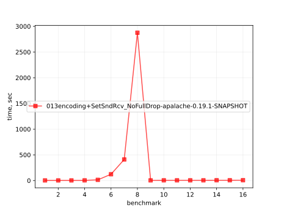
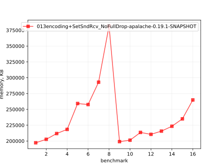
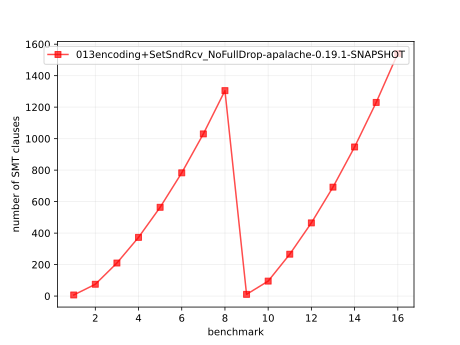

# Results of 013encoding+SetSndRcv_NoFullDrop-apalache

## 1. Awesome plots

### 1.1. Time (logarithmic scale)

### 1.2. Time (linear)

### 1.3. Memory (logarithmic scale)

### 1.4. Memory (linear)

### 1.5. Number of arena cells (linear)

### 1.6. Number of SMT clauses (linear)

## 2. Input parameters

no  |  filename                                 |  tool      |  timeout  |  init  |  inv  |  next  |  args
----|-------------------------------------------|------------|-----------|--------|-------|--------|-----------------------------------------------------
1   |  array-encoding/SetSndRcv_NoFullDrop.tla  |  apalache  |  2h       |  Init  |  Inv  |  Next  |  --smt-encoding=arrays --length=0 --cinit=CInit0
2   |  array-encoding/SetSndRcv_NoFullDrop.tla  |  apalache  |  2h       |  Init  |  Inv  |  Next  |  --smt-encoding=arrays --length=2 --cinit=CInit2
3   |  array-encoding/SetSndRcv_NoFullDrop.tla  |  apalache  |  2h       |  Init  |  Inv  |  Next  |  --smt-encoding=arrays --length=4 --cinit=CInit4
4   |  array-encoding/SetSndRcv_NoFullDrop.tla  |  apalache  |  2h       |  Init  |  Inv  |  Next  |  --smt-encoding=arrays --length=6 --cinit=CInit6
5   |  array-encoding/SetSndRcv_NoFullDrop.tla  |  apalache  |  2h       |  Init  |  Inv  |  Next  |  --smt-encoding=arrays --length=8 --cinit=CInit8
6   |  array-encoding/SetSndRcv_NoFullDrop.tla  |  apalache  |  2h       |  Init  |  Inv  |  Next  |  --smt-encoding=arrays --length=10 --cinit=CInit10
7   |  array-encoding/SetSndRcv_NoFullDrop.tla  |  apalache  |  2h       |  Init  |  Inv  |  Next  |  --smt-encoding=arrays --length=12 --cinit=CInit12
8   |  array-encoding/SetSndRcv_NoFullDrop.tla  |  apalache  |  2h       |  Init  |  Inv  |  Next  |  --smt-encoding=arrays --length=14 --cinit=CInit14
9   |  array-encoding/SetSndRcv_NoFullDrop.tla  |  apalache  |  2h       |  Init  |  Inv  |  Next  |  --smt-encoding=oopsla19 --length=0 --cinit=CInit0
10  |  array-encoding/SetSndRcv_NoFullDrop.tla  |  apalache  |  2h       |  Init  |  Inv  |  Next  |  --smt-encoding=oopsla19 --length=2 --cinit=CInit2
11  |  array-encoding/SetSndRcv_NoFullDrop.tla  |  apalache  |  2h       |  Init  |  Inv  |  Next  |  --smt-encoding=oopsla19 --length=4 --cinit=CInit4
12  |  array-encoding/SetSndRcv_NoFullDrop.tla  |  apalache  |  2h       |  Init  |  Inv  |  Next  |  --smt-encoding=oopsla19 --length=6 --cinit=CInit6
13  |  array-encoding/SetSndRcv_NoFullDrop.tla  |  apalache  |  2h       |  Init  |  Inv  |  Next  |  --smt-encoding=oopsla19 --length=8 --cinit=CInit8
14  |  array-encoding/SetSndRcv_NoFullDrop.tla  |  apalache  |  2h       |  Init  |  Inv  |  Next  |  --smt-encoding=oopsla19 --length=10 --cinit=CInit10
15  |  array-encoding/SetSndRcv_NoFullDrop.tla  |  apalache  |  2h       |  Init  |  Inv  |  Next  |  --smt-encoding=oopsla19 --length=12 --cinit=CInit12
16  |  array-encoding/SetSndRcv_NoFullDrop.tla  |  apalache  |  2h       |  Init  |  Inv  |  Next  |  --smt-encoding=oopsla19 --length=14 --cinit=CInit14

## 3. Detailed results: 013encoding+SetSndRcv_NoFullDrop-apalache-0.18.1-SNAPSHOT.csv

01:no  |  02:tool   |  03:status  |  04:time_sec  |  05:depth  |  05:mem_kb  |  10:ninit_trans  |  11:ninit_trans  |  12:ncells  |  13:nclauses  |  14:navg_clause_len
-------|------------|-------------|---------------|------------|-------------|------------------|------------------|-------------|---------------|--------------------
1      |  apalache  |  NoError    |  4s           |  0         |  198MB      |  0               |  0               |  12         |  7.0          |  5.0
2      |  apalache  |  NoError    |  4s           |  0         |  207MB      |  0               |  0               |  80         |  79           |  8.0
3      |  apalache  |  NoError    |  4s           |  0         |  219MB      |  0               |  0               |  214        |  233          |  10
4      |  apalache  |  NoError    |  6s           |  0         |  220MB      |  0               |  0               |  372        |  435          |  11
5      |  apalache  |  NoError    |  30s          |  0         |  248MB      |  0               |  0               |  554        |  685          |  12
6      |  apalache  |  NoError    |  6m06s        |  0         |  284MB      |  0               |  0               |  760        |  983          |  12
7      |  apalache  |  NoError    |  12m          |  0         |  309MB      |  0               |  0               |  990        |  1.0K         |  12
8      |  apalache  |  Timeout    |  2h02m        |  0         |  3.0MB      |  0               |  0               |  1.0K       |  1.0K         |  13
9      |  apalache  |  NoError    |  5s           |  0         |  203MB      |  0               |  0               |  13         |  11           |  6.0
10     |  apalache  |  NoError    |  5s           |  0         |  218MB      |  0               |  0               |  88         |  99           |  8.0
11     |  apalache  |  NoError    |  6s           |  0         |  218MB      |  0               |  0               |  240        |  289          |  10
12     |  apalache  |  NoError    |  6s           |  0         |  217MB      |  0               |  0               |  416        |  527          |  11
13     |  apalache  |  NoError    |  6s           |  0         |  230MB      |  0               |  0               |  616        |  813          |  12
14     |  apalache  |  NoError    |  6s           |  0         |  238MB      |  0               |  0               |  840        |  1.0K         |  13
15     |  apalache  |  NoError    |  6s           |  0         |  251MB      |  0               |  0               |  1.0K       |  1.0K         |  14
16     |  apalache  |  NoError    |  7s           |  0         |  251MB      |  0               |  0               |  1.0K       |  1.0K         |  14
