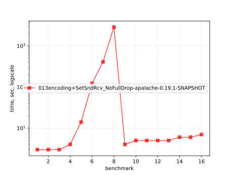

# Results of 013encoding+SetSndRcv_NoFullDrop-apalache

## 1. Awesome plots

### 1.1. Time (logarithmic scale)

### 1.2. Time (linear)

### 1.3. Memory (logarithmic scale)

### 1.4. Memory (linear)

### 1.5. Number of arena cells (linear)

### 1.6. Number of SMT clauses (linear)

## 2. Input parameters

no  |  filename                                 |  tool      |  timeout  |  init  |  inv  |  next  |  args
----|-------------------------------------------|------------|-----------|--------|-------|--------|-----------------------------------------------------
1   |  array-encoding/SetSndRcv_NoFullDrop.tla  |  apalache  |  2h       |  Init  |  Inv  |  Next  |  --smt-encoding=arrays --length=0 --cinit=CInit0
2   |  array-encoding/SetSndRcv_NoFullDrop.tla  |  apalache  |  2h       |  Init  |  Inv  |  Next  |  --smt-encoding=arrays --length=2 --cinit=CInit2
3   |  array-encoding/SetSndRcv_NoFullDrop.tla  |  apalache  |  2h       |  Init  |  Inv  |  Next  |  --smt-encoding=arrays --length=4 --cinit=CInit4
4   |  array-encoding/SetSndRcv_NoFullDrop.tla  |  apalache  |  2h       |  Init  |  Inv  |  Next  |  --smt-encoding=arrays --length=6 --cinit=CInit6
5   |  array-encoding/SetSndRcv_NoFullDrop.tla  |  apalache  |  2h       |  Init  |  Inv  |  Next  |  --smt-encoding=arrays --length=8 --cinit=CInit8
6   |  array-encoding/SetSndRcv_NoFullDrop.tla  |  apalache  |  2h       |  Init  |  Inv  |  Next  |  --smt-encoding=arrays --length=10 --cinit=CInit10
7   |  array-encoding/SetSndRcv_NoFullDrop.tla  |  apalache  |  2h       |  Init  |  Inv  |  Next  |  --smt-encoding=arrays --length=12 --cinit=CInit12
8   |  array-encoding/SetSndRcv_NoFullDrop.tla  |  apalache  |  2h       |  Init  |  Inv  |  Next  |  --smt-encoding=arrays --length=14 --cinit=CInit14
9   |  array-encoding/SetSndRcv_NoFullDrop.tla  |  apalache  |  2h       |  Init  |  Inv  |  Next  |  --smt-encoding=oopsla19 --length=0 --cinit=CInit0
10  |  array-encoding/SetSndRcv_NoFullDrop.tla  |  apalache  |  2h       |  Init  |  Inv  |  Next  |  --smt-encoding=oopsla19 --length=2 --cinit=CInit2
11  |  array-encoding/SetSndRcv_NoFullDrop.tla  |  apalache  |  2h       |  Init  |  Inv  |  Next  |  --smt-encoding=oopsla19 --length=4 --cinit=CInit4
12  |  array-encoding/SetSndRcv_NoFullDrop.tla  |  apalache  |  2h       |  Init  |  Inv  |  Next  |  --smt-encoding=oopsla19 --length=6 --cinit=CInit6
13  |  array-encoding/SetSndRcv_NoFullDrop.tla  |  apalache  |  2h       |  Init  |  Inv  |  Next  |  --smt-encoding=oopsla19 --length=8 --cinit=CInit8
14  |  array-encoding/SetSndRcv_NoFullDrop.tla  |  apalache  |  2h       |  Init  |  Inv  |  Next  |  --smt-encoding=oopsla19 --length=10 --cinit=CInit10
15  |  array-encoding/SetSndRcv_NoFullDrop.tla  |  apalache  |  2h       |  Init  |  Inv  |  Next  |  --smt-encoding=oopsla19 --length=12 --cinit=CInit12
16  |  array-encoding/SetSndRcv_NoFullDrop.tla  |  apalache  |  2h       |  Init  |  Inv  |  Next  |  --smt-encoding=oopsla19 --length=14 --cinit=CInit14

## 3. Detailed results: 013encoding+SetSndRcv_NoFullDrop-apalache-0.19.1-SNAPSHOT.csv

01:no  |  02:tool   |  03:status  |  04:time_sec  |  05:depth  |  05:mem_kb  |  10:ninit_trans  |  11:ninit_trans  |  12:ncells  |  13:nclauses  |  14:navg_clause_len
-------|------------|-------------|---------------|------------|-------------|------------------|------------------|-------------|---------------|--------------------
1      |  apalache  |  NoError    |  3s           |  0         |  192MB      |  0               |  0               |  12         |  7.0          |  6.0
2      |  apalache  |  NoError    |  3s           |  0         |  197MB      |  0               |  0               |  80         |  75           |  9.0
3      |  apalache  |  NoError    |  3s           |  0         |  206MB      |  0               |  0               |  214        |  210          |  11
4      |  apalache  |  NoError    |  4s           |  0         |  213MB      |  0               |  0               |  372        |  373          |  12
5      |  apalache  |  NoError    |  14s          |  0         |  253MB      |  0               |  0               |  554        |  564          |  14
6      |  apalache  |  NoError    |  2m02s        |  0         |  251MB      |  0               |  0               |  760        |  783          |  15
7      |  apalache  |  NoError    |  6m06s        |  0         |  286MB      |  0               |  0               |  990        |  1.0K         |  16
8      |  apalache  |  NoError    |  47m          |  0         |  372MB      |  0               |  0               |  1.0K       |  1.0K         |  16
9      |  apalache  |  NoError    |  4s           |  0         |  194MB      |  0               |  0               |  13         |  11           |  6.0
10     |  apalache  |  NoError    |  5s           |  0         |  196MB      |  0               |  0               |  88         |  95           |  9.0
11     |  apalache  |  NoError    |  5s           |  0         |  208MB      |  0               |  0               |  240        |  266          |  11
12     |  apalache  |  NoError    |  5s           |  0         |  205MB      |  0               |  0               |  416        |  465          |  12
13     |  apalache  |  NoError    |  5s           |  0         |  210MB      |  0               |  0               |  616        |  692          |  14
14     |  apalache  |  NoError    |  6s           |  0         |  218MB      |  0               |  0               |  840        |  947          |  15
15     |  apalache  |  NoError    |  6s           |  0         |  229MB      |  0               |  0               |  1.0K       |  1.0K         |  17
16     |  apalache  |  NoError    |  7s           |  0         |  258MB      |  0               |  0               |  1.0K       |  1.0K         |  18
